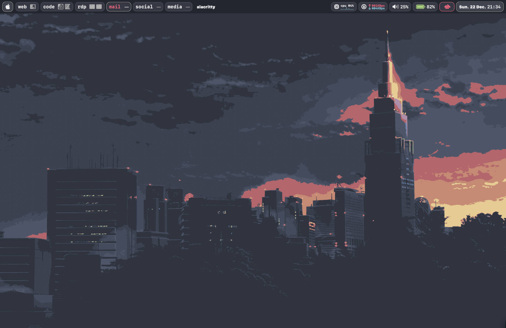

# Welcome to my dotfiles for macOS

## Features

- window manager using aerospace
- (way)bar using sketchybar
- neovim
- (optional) lazyvim
- manage .rc files using rcm

## clone this repo and run install.sh; or

or:

## install brew

## use rcm to install/symlink rc-files

## install software/apps

## alacritty themes

## allow (homebrew) via terminal

xattr -d com.apple.quarantine /Applications/Alacritty.app

### thanks to

- https://github.com/JaKooLit/Wallpaper-Bank
- https://github.com/FelixKratz/SketchyBar
- bin101 ???
