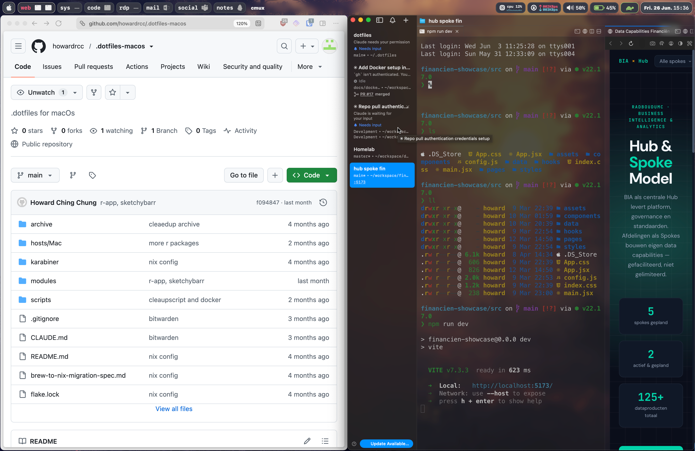

# dotfiles

macOS system configuration managed with **nix-darwin** + **Home Manager** + **Flakes**.  
Apple Silicon (aarch64-darwin), Determinate Systems Nix installer.



---

## Stack

| Layer | Tool |
|---|---|
| Nix framework | [nix-darwin](https://github.com/LnL7/nix-darwin) + [Home Manager](https://github.com/nix-community/home-manager) |
| Window manager | [AeroSpace](https://github.com/nikitabobko/AeroSpace) |
| Status bar | [SketchyBar](https://github.com/FelixKratz/SketchyBar) |
| Terminal | [Ghostty](https://ghostty.org) |
| Editor | [Neovim](https://neovim.io) |
| Shell | Zsh + [Starship](https://starship.rs) prompt |
| Key remapping | [Karabiner-Elements](https://karabiner-elements.pqrs.org) |
| GUI apps | Homebrew Casks (declarative) |
| CLI tools | Nix packages |

---

## Repo Structure

```
~/.dotfiles/
├── flake.nix                       # Inputs: nixpkgs-unstable, nix-darwin, home-manager
├── hosts/Mac/default.nix           # Host entrypoint — imports all modules
└── modules/
    ├── darwin/
    │   ├── system.nix              # macOS defaults (Dock, Finder, trackpad…)
    │   ├── packages.nix            # CLI tools via environment.systemPackages
    │   ├── homebrew.nix            # Declarative Homebrew casks + brews
    │   └── fonts.nix               # Nerd Fonts via nixpkgs
    └── home/
        ├── default.nix             # Home Manager entrypoint
        ├── shell.nix               # Zsh + Starship + zoxide + fzf + direnv + bat
        ├── git.nix                 # programs.git + delta pager
        ├── terminal.nix            # Ghostty config
        ├── aerospace.nix           # AeroSpace tiling config
        ├── karabiner.nix           # Karabiner key-remap config
        └── sketchybar/             # SketchyBar Lua config + compiled event providers
```

---

## Fresh Install

### 1. Install Nix (Determinate Systems)

```sh
curl --proto '=https' --tlsv1.2 -sSf -L \
  https://install.determinate.systems/nix | sh -s -- install
```

Determinate enables flakes and nix-command out of the box.

### 2. Clone this repo

```sh
git clone https://github.com/howardchingchung/dotfiles ~/.dotfiles
```

### 3. Bootstrap nix-darwin (first time only)

```sh
nix run nix-darwin -- switch --flake ~/.dotfiles
```

This builds the system and activates it. Homebrew will be installed automatically on first run if not present.

### 4. Rebuild (all subsequent runs)

```sh
sudo darwin-rebuild switch --flake ~/.dotfiles
# or use the alias:
update
```

---

## Everyday Commands

| Command | What it does |
|---|---|
| `update` | Rebuild + switch to new config |
| `cleanup` | Collect Nix garbage older than 7 days + optimise store |
| `nix flake update --flake ~/.dotfiles` | Update all flake inputs (nixpkgs, nix-darwin, HM) |
| `lg` | Open lazygit |
| `ll` | `eza` long listing with icons |

---

## Key Design Decisions

- **`nix.enable = false`** — Determinate Systems manages the Nix daemon; letting nix-darwin also manage it causes conflicts.
- **`system.primaryUser = "howard"`** — required by nix-darwin for user-level macOS defaults (Dock, Finder, NSGlobalDomain, Homebrew).
- **GUI apps via Homebrew Casks** — Nix packaging for macOS GUI apps is still unreliable; Homebrew Casks are more stable and better maintained for this.
- **SketchyBar via Homebrew brew** — the launchd service PATH doesn't include the Nix store, so `lua` and `sketchybar` itself live in Homebrew where the service can find them.
- **Docker via Colima** — lightweight Docker daemon without Docker Desktop. Start with `colima start --cpu 4 --memory 8 --arch aarch64`.

---

## Credits

- [FelixKratz/SketchyBar](https://github.com/FelixKratz/SketchyBar)
- [JaKooLit/Wallpaper-Bank](https://github.com/JaKooLit/Wallpaper-Bank)
- [nix-darwin](https://github.com/LnL7/nix-darwin)
- [nix-community/home-manager](https://github.com/nix-community/home-manager)
