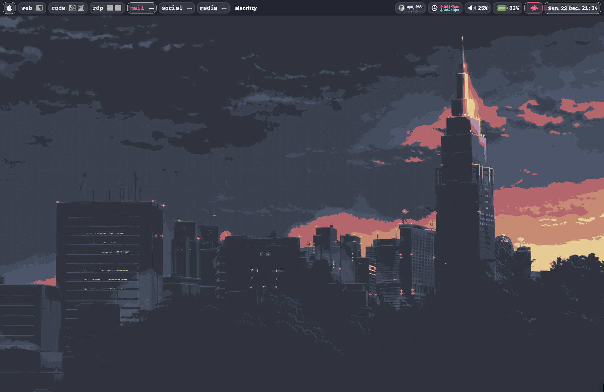

# Welcome to my dotfiles for macOS



## Features

- window manager using aerospace
- (way)bar using sketchybar
- neovim
- (optional) lazyvim
- manage .rc files using rcm
- karabiner for key remapping and rdp

## apps

Zen browser
neovim
ghostty
tmux
fd
fzf
z
brew

## clone this repo and run install.sh; or

or:

## install brew

## use rcm to install/symlink rc-files

## install software/apps

## alacritty themes

## allow (homebrew) via terminal

xattr -d com.apple.quarantine /Applications/Alacritty.app

### thanks to

- <https://github.com/JaKooLit/Wallpaper-Bank>
- <https://github.com/FelixKratz/SketchyBar>
- bin101 ??

# install nix

install nix, via nixos.org or determinate.
determinate adds some tweaks out of the box such as flakes and experimental features

```shell
curl --proto '=https' --tlsv1.2 -sSf -L \
  https://install.determinate.systems/nix | sh -s -- install?
``

# create a flake.nix (or use one from the repoe

bootstrap darwin for rebuild
```shell
nix run nix-darwin -- switch --flake ~/.dotfiles`
``

nix build ~/.dotfiles#darwinConfigurations.Mac.system
sudo ./result/activate`
